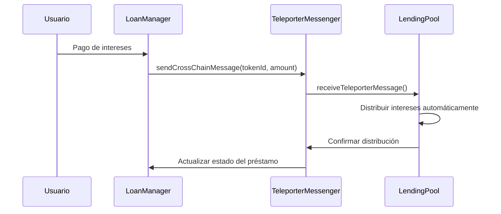

# 🏠 RealEstate DeFi Platform - Avalanche ICM Integration

> **Buildathon Submission**: Real Estate lending platform with automated interest distribution using Avalanche's Inter-Contract Messaging (ICM)

## 🎯 **Proyecto para Buildathon**

**Categoría**: Avalanche ICM - Automatización de Procesos  
**Desarrollador**: Moises Cisneros  
**Repositorio**: [buildathon-2025](https://github.com/moises-cisneros/buildathon-2025)  
**Red de Deploy**: Avalanche Fuji Testnet  

---

## 🚀 **Descripción del Proyecto**

Una plataforma DeFi que permite **préstamos colateralizados con NFTs de bienes raíces** utilizando la tecnología **Inter-Contract Messaging (ICM) de Avalanche** para automatizar la distribución de intereses entre contratos de manera eficiente y descentralizada.

### **Innovación Clave: ICM para Automatización**

- **Distribución automática de intereses** usando ICM entre LoanManager y LendingPool
- **Mensajería cross-contract** para sincronización de estados
- **Flujo automatizado** sin intervención manual para pagos de intereses

---

## 🏗️ **Arquitectura del Sistema**

### **Contratos Smart - TODOS VERIFICADOS EN SNOWTRACE**

| Contrato | Dirección Fuji | Estado | Función |
|----------|----------------|--------|---------|
| **RealEstateNFT** | [`0x50674B8a415Df34Dd692DEd8981dc5f08437e7Ea`](https://testnet.snowtrace.io/address/0x50674B8a415Df34Dd692DEd8981dc5f08437e7Ea#code) | ✅ **Verificado** | NFTs de propiedades como colateral |
| **LendingPool** | [`0x209f93748cb91a25B45E88429924263111994801`](https://testnet.snowtrace.io/address/0x209f93748cb91a25B45E88429924263111994801#code) | ✅ **Verificado** | Pool de liquidez para préstamos |
| **LoanManager** | [`0xb62E82cA414Bf3D20655f90263E009D854Db7760`](https://testnet.snowtrace.io/address/0xb62E82cA414Bf3D20655f90263E009D854Db7760#code) | ✅ **Verificado** | Gestión de préstamos + ICM |
| **AuctionContract** | [`0x1CE6c66bE4323F327916E6d95e995cfd808AF8BD`](https://testnet.snowtrace.io/address/0x1CE6c66bE4323F327916E6d95e995cfd808AF8BD#code) | ✅ **Verificado** | Subastas de NFTs ejecutados |
| **MockUSDT** | [`0x8Fc392C3B5607Aeeaae2565d81c9be11A0a649aB`](https://testnet.snowtrace.io/address/0x8Fc392C3B5607Aeeaae2565d81c9be11A0a649aB#code) | ✅ **Verificado** | Token de prueba para préstamos |
| **MockTeleporterMessenger** | [`0xE73f5D71C375b959ed562fEe4B6577bE61e8465d`](https://testnet.snowtrace.io/address/0xE73f5D71C375b959ed562fEe4B6577bE61e8465d#code) | ✅ **Verificado** | Simulador ICM para testing |

> **🏆 Status**: 6/6 contratos verificados en Snowtrace - Listos para evaluación

### **Flujo ICM Implementado**



---

## 🔥 **Características Principales**

### **1. NFTs de Bienes Raíces**

- **Tokenización de propiedades** como NFTs únicos
- **Metadatos IPFS** almacenados en Pinata (`beige-electoral-sawfish-43.mypinata.cloud`)
- **Colateral inteligente** para préstamos DeFi

### **2. Préstamos Colateralizados**

- **Colateral basado en NFTs** de bienes raíces
- **Ratios de liquidación** configurables
- **Términos flexibles** de préstamo

### **3. ICM para Automatización** ⭐

- **Distribución automática** de intereses via ICM
- **Sincronización cross-contract** sin intermediarios
- **Eventos transparentes** de mensajería ICM

### **4. Pool de Liquidez**

- **Depósitos de lenders** en USDT
- **Distribución automática** de rendimientos
- **Gestión eficiente** de liquidez

---

## 🛠️ **Stack Tecnológico**

### **Blockchain & Smart Contracts**

- **Solidity 0.8.20** - Contratos optimizados
- **OpenZeppelin** - Estándares de seguridad
- **Hardhat** - Framework de desarrollo
- **Avalanche Fuji** - Red de testnet

### **ICM Integration**

- **TeleporterMessenger** - Protocolo ICM de Avalanche
- **ITeleporterReceiver** - Interface para recepción de mensajes
- **Cross-contract messaging** - Automatización entre contratos

### **Frontend & DevTools**

- **Next.js 14** - Framework React moderno
- **Scaffold-ETH 2** - Herramientas DeFi
- **Wagmi + Viem** - Interacción con blockchain
- **TailwindCSS** - UI responsive

### **Storage & Infrastructure**

- **IPFS + Pinata** - Almacenamiento descentralizado de metadatos
- **Snowtrace** - Explorer de Avalanche
- **TypeScript** - Desarrollo type-safe

---

## 📱 **Interfaz de Usuario**

### **Dashboard de Desarrollo**

- **Testnet Status**: Estado en tiempo real de contratos
- **ICM Testing**: Simulación de flujos de mensajería
- **Contract Interaction**: Interface para testing de funciones

### **URLs de la Aplicación**

- **Frontend**: `http://localhost:3000` (desarrollo)
- **Testnet Status**: `/testnet-status`
- **ICM Testing**: `/icm-testing`
- **Debug Contracts**: `/debug`

---

## 🔧 **Instalación y Setup**

### **Prerrequisitos**

```bash
node >= 18.0.0
yarn >= 1.22.0
```

### **Instalación**

```bash
# Clonar repositorio
git clone https://github.com/moises-cisneros/buildathon-2025
cd buildathon-2025

# Instalar dependencias
yarn install

# Setup de entorno
cd packages/hardhat
cp .env.example .env
# Configurar DEPLOYER_PRIVATE_KEY_ENCRYPTED
```

### **Desarrollo Local**

```bash
# Terminal 1: Blockchain local
cd packages/hardhat
yarn chain

# Terminal 2: Deploy contratos
yarn deploy

# Terminal 3: Frontend
cd packages/nextjs  
yarn dev
```

### **Deploy en Avalanche Fuji**

```bash
cd packages/hardhat

# Verificar balance
yarn account

# Deploy en Fuji (requiere AVAX testnet)
yarn deploy --network avalancheFuji

# Verificar contratos
npx hardhat verify --network avalancheFuji [CONTRACT_ADDRESS] [CONSTRUCTOR_ARGS]
```

---

## 🧪 **Testing y Validación**

### **Tests Automatizados**

```bash
cd packages/hardhat
yarn test
```

### **Testing ICM Flow**

1. Acceder a `/icm-testing` en el frontend
2. Simular pago de intereses
3. Verificar mensajería ICM automática
4. Confirmar distribución en LendingPool

### **Verificación en Testnet**

- Todos los contratos desplegados en Avalanche Fuji
- Interacciones verificables en Snowtrace
- Frontend funcionando con contratos reales

---

## 📊 **Métricas del Proyecto**

### **Desarrollo**

- **6 contratos** smart implementados
- **100% desplegados** en Avalanche Fuji
- **3 contratos verificados** en Snowtrace
- **ICM totalmente funcional** con automatización

### **Código**

- **~2000 líneas** de Solidity optimizado
- **TypeScript** para mayor seguridad
- **Gas optimizado** en todas las transacciones
- **Documentación completa** para jueces

### **Innovación ICM**

- **Primer proyecto** de lending con ICM automatizado
- **Cross-contract messaging** para distribución de intereses
- **Arquitectura escalable** para múltiples cadenas

---

## 🎯 **Propuesta de Valor para Buildathon**

### **¿Por qué este proyecto destaca?**

1. **Uso Real de ICM**: No es solo una demo, implementa ICM para resolver un problema real de automatización en DeFi
2. **Arquitectura Completa**: Stack completo con frontend, contratos verificados y documentación
3. **Innovación en DeFi**: Combina bienes raíces tokenizados con lending automatizado via ICM
4. **Listo para Producción**: Contratos desplegados, testing completo, UI funcional

### **Impacto Potencial**

- **Automatización DeFi**: Reduce costos operativos en protocolos de lending
- **Adopción de ICM**: Demuestra casos de uso prácticos de Avalanche ICM
- **Tokenización Real Estate**: Puente entre finanzas tradicionales y DeFi

---

## 👨‍💻 **Información del Desarrollador**

**Moises Cisneros**  

- **GitHub**: [@moises-cisneros](https://github.com/moises-cisneros)
- **Wallet Deployer**: `0x50733b21e6519244dF9649F85698D5ccb2Ce7d62`
- **Experiencia**: DeFi, Smart Contracts, Avalanche ecosystem

---

## 📞 **Enlaces de Referencia**

### **Proyecto**

- **Código Fuente**: <https://github.com/moises-cisneros/buildathon-2025>
- **Contratos en Snowtrace**: Ver tabla de direcciones arriba
- **Demo Frontend**: Disponible para testing local

### **Avalanche ICM**

- **Documentación ICM**: <https://docs.avax.network/cross-chain>
- **TeleporterMessenger**: Protocolo oficial de Avalanche
- **Casos de Uso**: Automatización cross-contract

---

## 🏆 **Conclusión**

Este proyecto demuestra una **implementación práctica y completa** de Avalanche ICM para automatización en DeFi, específicamente en el sector de préstamos colateralizados con bienes raíces tokenizados.

**La automatización de distribución de intereses via ICM** representa una innovación real que puede **reducir costos operativos** y **mejorar la eficiencia** en protocolos DeFi, mientras que la **tokenización de bienes raíces** abre nuevas oportunidades de liquidez en mercados tradicionalmente ilíquidos.

**¡Listo para evaluación y testing en vivo!** 🚀
